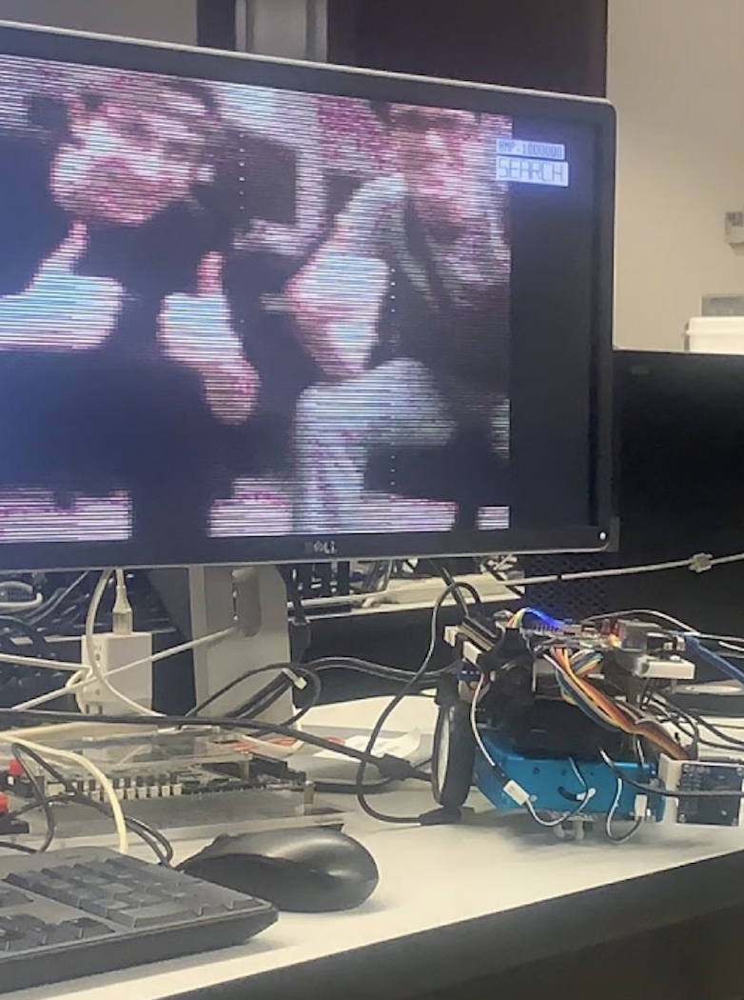

# ECE532
ECE532, Winter 2024 semester

## Information
Our project was developing a search-and-rescue robot, which is guided by audio localization. We used the Nexys 4 DDR FPGA. There are 4 key subsystems in our project:

### Audio Processing
Takes in audio waveform and produces the spectrum. Uses the onboard PDM microphone, sampled at 40 kHz (8-bit data). The FFT resolution is 64 samples / frame.

ECE532_Project/RobotFPGA/audio_project/audio_project.srcs/sources_1/new

### Robot
Control the robot motion through motors and sensors. Two independant motors controlled with PMOD H-Bridge, PMOD ultrasonic rangefinder, and the onboard accelerometer are used.

ECE532_Project/RobotFPGA/microblaze
(contains the entire integrated project)

### Stream
Pack and transmit video data through an ethernet connection. The connection is completely done in hardware (Verilog) and enables high-resolution video to be transmitted in real-time to a secondary FPGA.

ECE532_Project/RobotFPGA/stream and ECE532_Project/BasestationFPGA/

### Display
Interface with the camera on the robot, and then display video on a VGA display on the other end of the ethernet pipeline.

ECE532_Project/BasestationFPGA/OV7670/OV7670.srcs/sources_1/new and ECE532_Project/BasestationFPGA/OV7670/OV7670.srcs/sources_1/new/ov7670_vga.vhd

## Additional Contents
The final report and presentation are both found in the *doc* folder. Videos of the project are found in the *videos* folder.

